##### These procedure steps will be followed on the simulator

1. Click on the simulation button a new window will open as shown below. Hover on the description to view the definitions.  
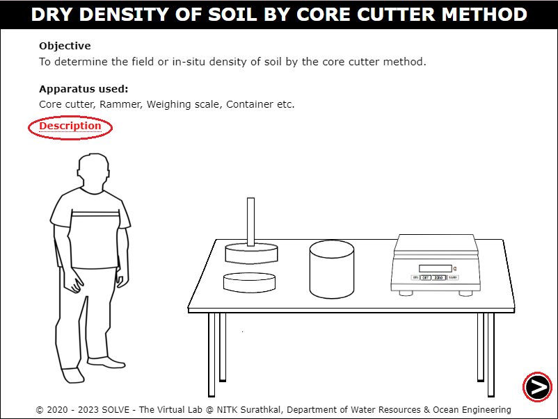 

2. Click on the measuring scale and then on the vernier calliper to measure the height and weight of the core cutter respectively. Then calculate the volume of the core cutter and click on the "Next Button" at the bottom right corner to move to the next step. 
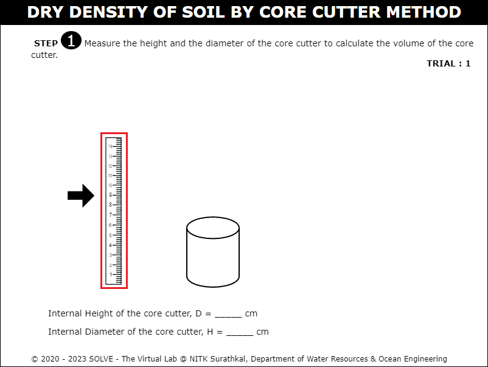  
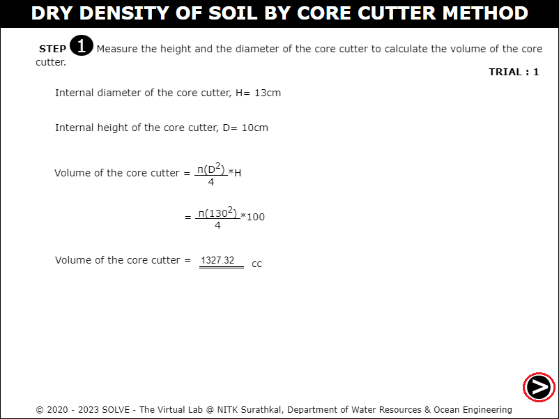 

3. Click on the core cutter to keep it over the weighing balance and measure its empty weight. Answer the formative question to move forward in the simulation. 
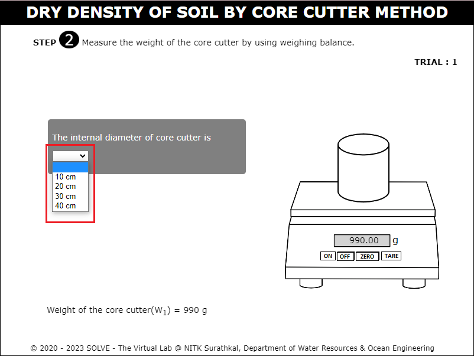 

4. Click on the shovel to level the surface of the soil to be tested, and click on the core cutter to keep it over the soil surface. 
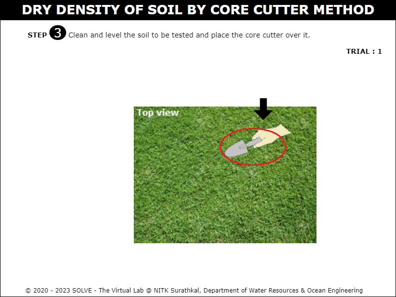  
 

5. Click on the rammer to insert the core cutter inside the soil surface. 
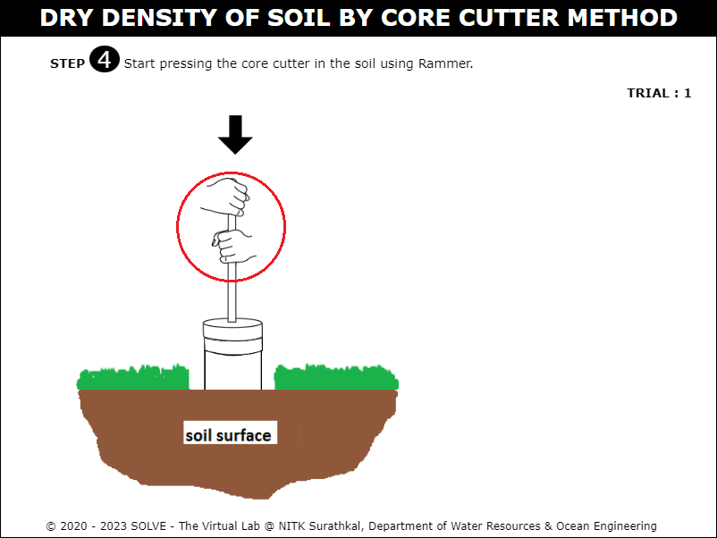  
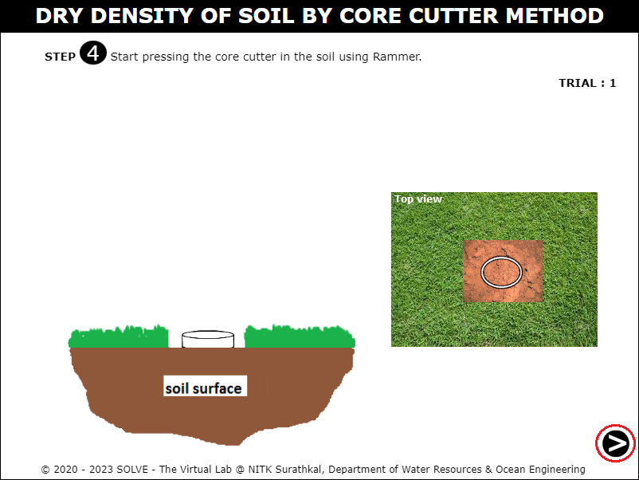 

6. Click on the core cutter to remove it from the soil without disturbing the sample collected within it. 
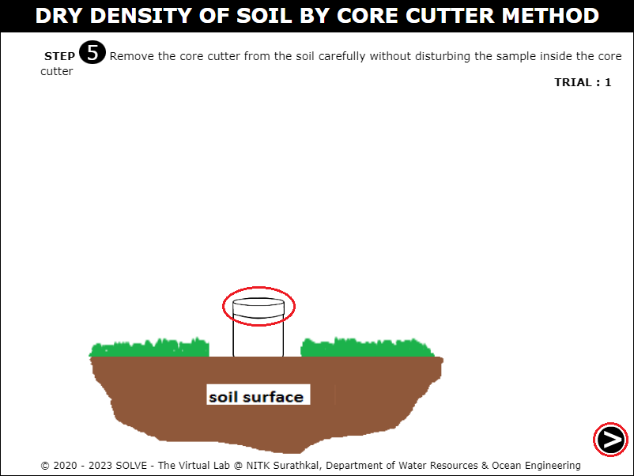 

7. Measure the weight of the core cutter along with the soil sample and click on the "Next Button". 
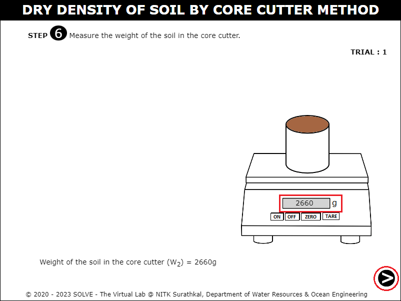 

8. Calculate the value of the bulk density of the soil sample using the formula and click on the "Next Button". 
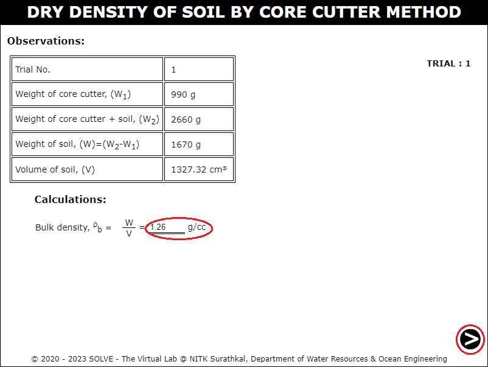 

9. Click on the empty container to keep it over the weighing balance to record its weight, and click on the "Next Button". 
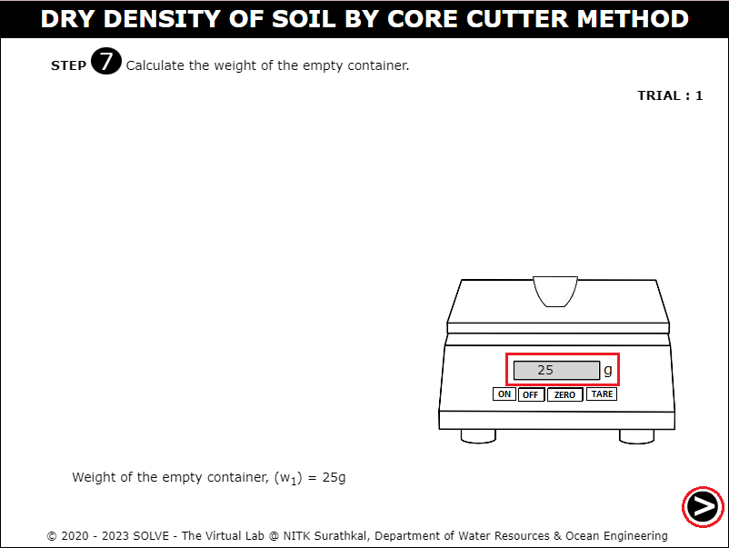 

10. Click on the core cutter to remove all the soil collected, then put a sample of wet soil into the empty container and determine its weight.  
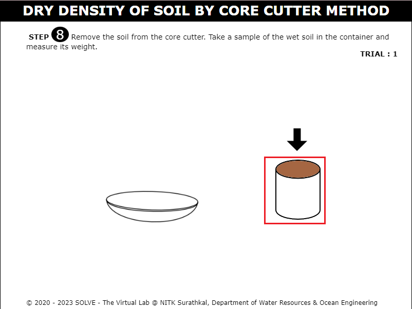  
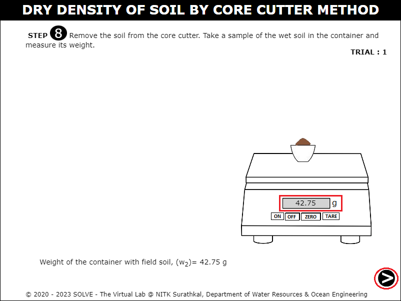 

11. Place the container with wet soil in the oven for 24 hours.  
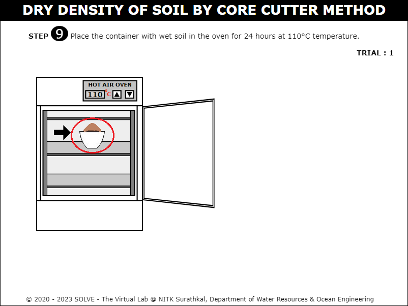 

12. Take out the soil sample out of oven after 24 hours. Then determine the weight of the container along with the oven dried soil sample.  
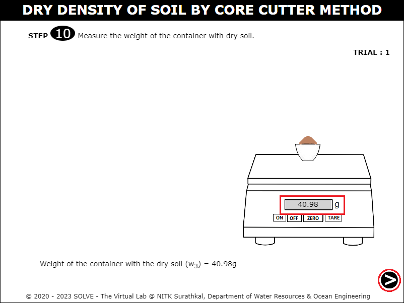 

13. Based on the values obtained, calculate the water content and dry density of the soil sample using the formula. Click on the check button to verify your answer. 
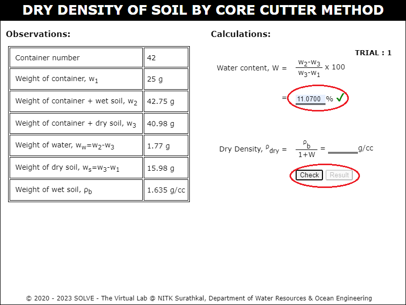 

14. Repeat the procedure from step 8 to 11 and calculate the dry density for different samples and tabulate the results. 
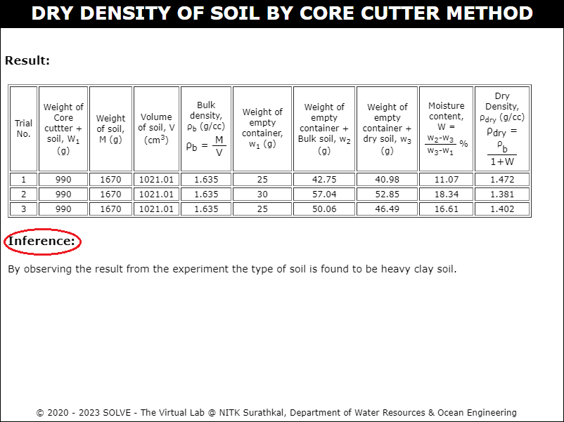  
