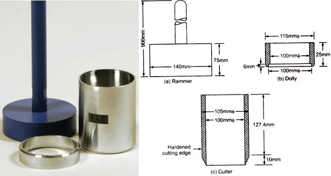

### INTRODUCTION 

The in-situ density refers to the mass per unit volume of soil in the undisturbed state or compacted soil in-place. The moisture content will vary from time and hence the in-situ density also. So it is required to present the test result in terms of dry density.

Field density is used in finding the stress in the soil due to its overburden pressure. Field density values have a very vast range of applications and play an important role in determining various parameters as mentioned below.

<ol style="text-align: justify;">
<li>Estimating the bearing capacity of soil foundation systems, settlement of footings, earth pressures behind the retaining walls and embankments.</li>
<li>The stability of natural slopes, dams, embankments and cuts is checked with the help of the density of those soils.</li>
<li>It is the density that controls the field compaction of soils. 
<li>The permeability of soils depends upon their density.</li>
<li>The relative density of cohesionless soils is found by knowing the dry density of Soil in natural, loosest and densest states.</li>
<li>Void ratio, porosity and degree of saturation also can be calculated using the density of Soil.</li>
</ol>

### Core Cutter Method :

Core cutter is suitable for soft to medium cohesive soils, in which the cutter can be driven. It is not possible to drive the cutter into hard, boulder or murrum soils. In such a case, other methods are adopted.
In this method the core cutter is taken to the field and the area is cleared for any debris
Now the cutter is inserted into the ground, and then taken out without disturbing the soil collected inside the core cutter mould.
The core cutter is then brought back to the lab for further analysis.

  
  
Core Cutter Apparatus  

( Source: <a href="https://i0.wp.com/theconstructor.org/wp-content/uploads/2013/11/soil-core-cutter-apparatus.jpg?fit=683%2C365&ssl=1">https://www.cibsejournal.com/cpd/modules/2011-12/
</a>)

#### Formula used for the calculation of dry density :

The formula used to calculate the field density of soil which was collected during the conduction of the experiment :

 

The formula used to calculate the field soil water content :

 

The formula to calculate the dry density of the soil sample collected from field :

 
