##### These procedure steps will be followed on the simulator

1. When you click on the Dry density of soil by core cutter method file, a new window will open as shown below; click on the description text box to view the definitions. Click on the Next button at the bottom right corner to move to the next step. 
 

2. Click on the measuring scale and Vernier calliper and measure the height and weight of the core cutter and calculate the volume of the core cutter. 
 
 

3. Click on the core cutter to keep it over the weighing balance and measure its empty weight and click on the Next button.  
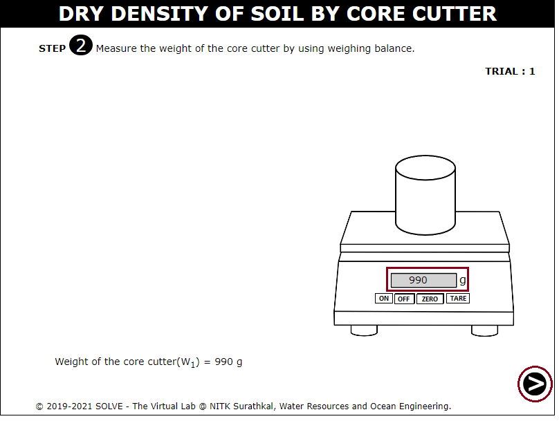 

4. Click on the hand to level the surface of the soil to be tested, and click on the core cutter to keep it over the soil surface. 
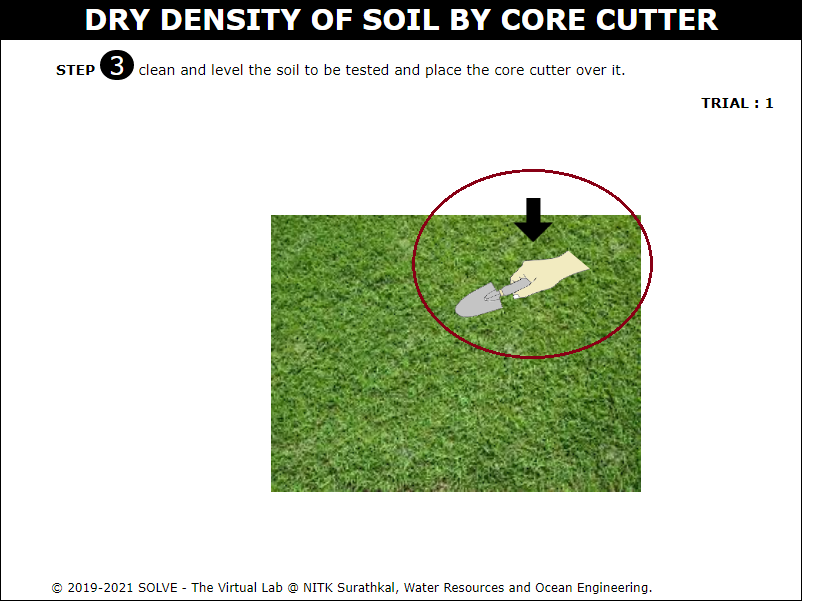 
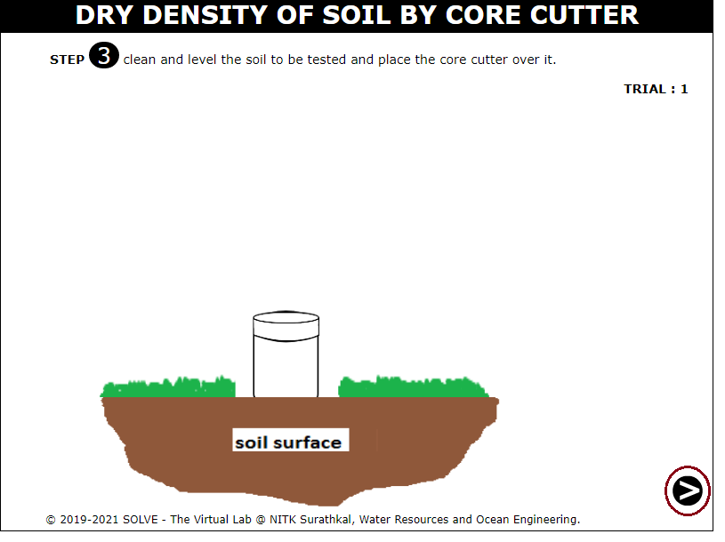 

5. Click on the hand to fix the rammer over the core cutter and click on the next button. 
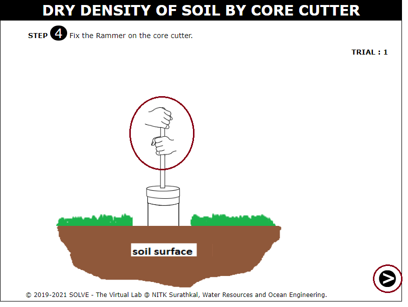 

6. Click on the hand holding the rammer to press the core cutter inside the soil surface to be tested. 
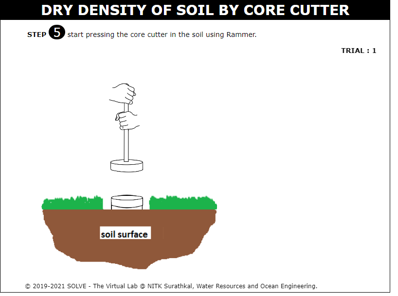 

7. Click on the hand to lift the rammer from the surface of the core cutter and click on the core cutter to lift the core cutter from the soil. 
 
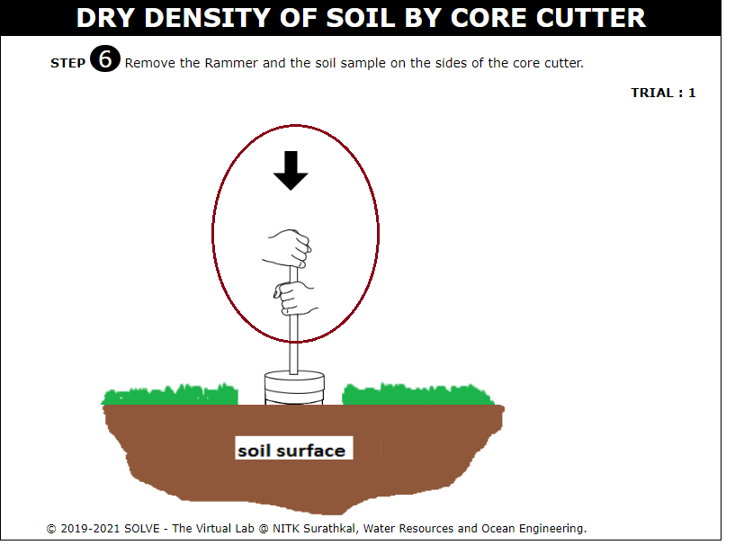 

8. Click on the core cutter with a soil sample to keep it over the weighing balance to record its weight, and click on the Next button. 
 
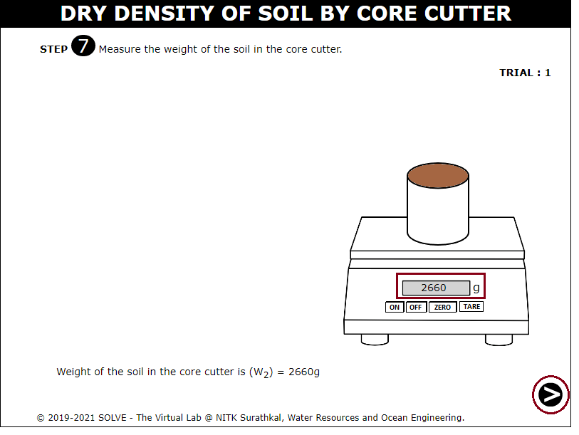 

9. Calculate the value of the bulk density of the soil sample using the formula and click on the Next button. 
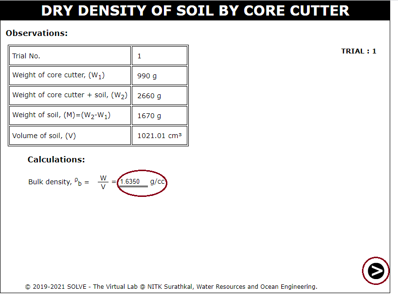 

10. Click on the empty container to keep it over the weighing balance to record its weight, and click on the Next button. 
 

11. Click on the core cutter to pour the soil sample to the dish and click on the hand to mix and pour to the container. 
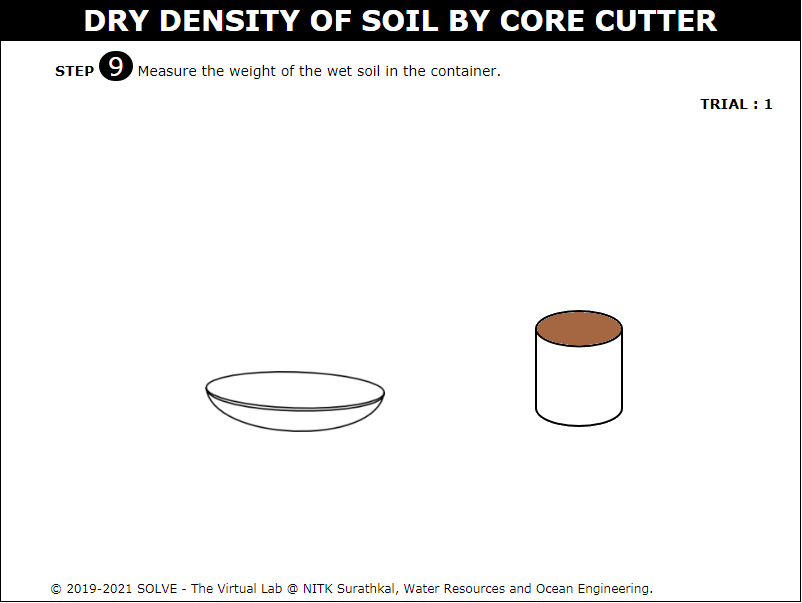 
 

12. Click on the container with the soil sample to keep it over the weighing balance to record its weight, and click on the Next button.  
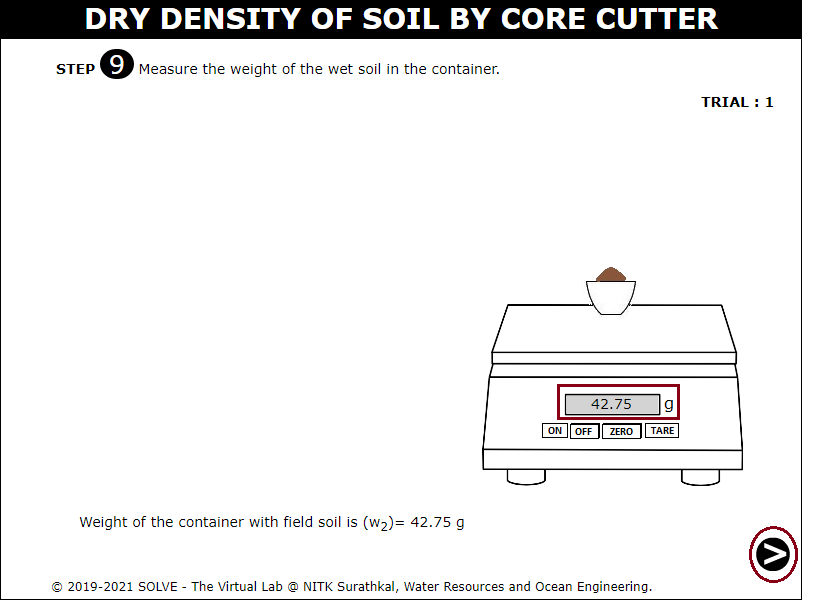 

13. Click on the oven door to open and click on the container to keep it inside the oven and click on the arrow to change the temperature, and click on the Next button. 
 

14. Click on the door of the oven to open it and click on the container to keep it outside from the oven, and click on the Next button. 
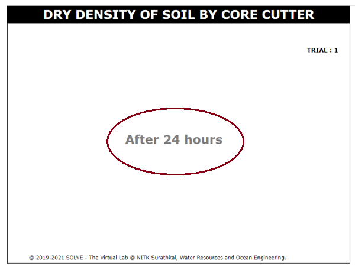 

15. Click on the container with dry soil to keep it over the weighing balance to record its weight, and click on the Next button. 
 

16. By using the formula, calculate the water content and dry density of the soil sample and enter the value in appropriate blank spaces. 
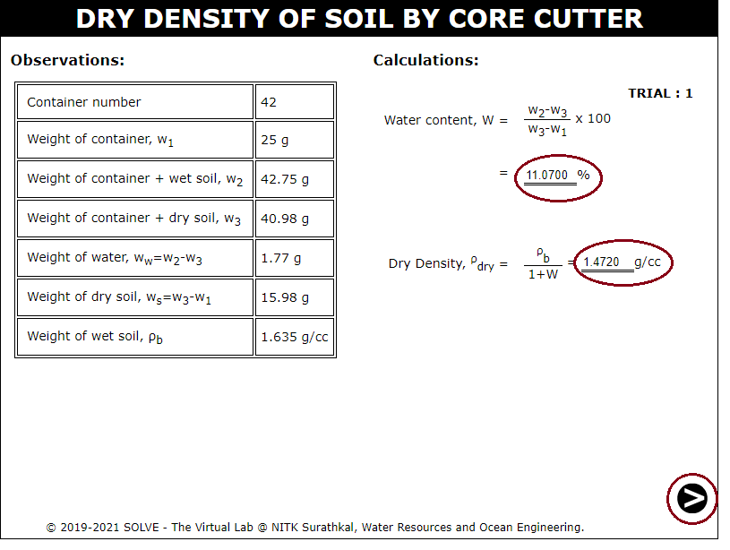 

17. Repeat the procedure from 8 to 11 and calculate the dry density for different trails and tabulate the results. 
 
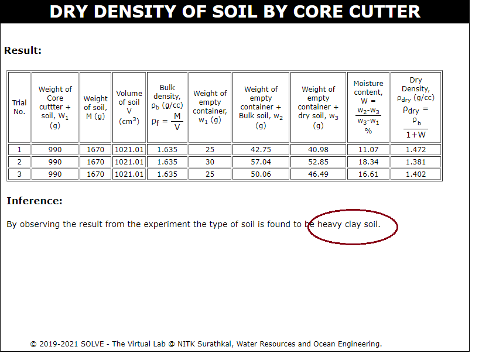 
